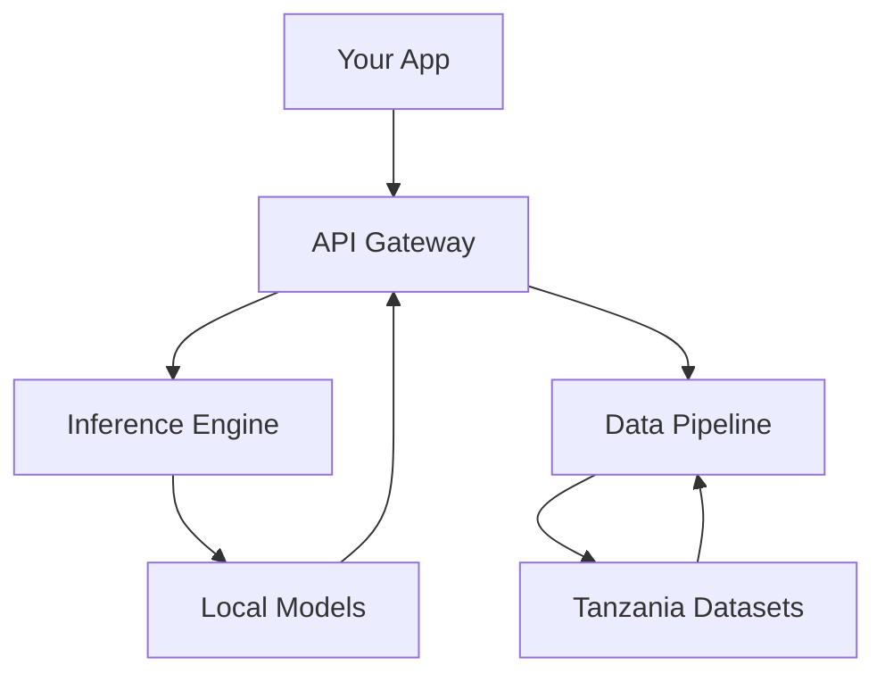

## Overview

AI4TZA empowers you to build AI applications tailored for Tanzania's unique challenges. You interact with the platform through a RESTful API at `https://api.example.com`, leveraging models trained on local datasets for agriculture, healthcare, and education. Core concepts include modular architecture, domain-specific terminology, privacy-compliant data flows, and scalable infrastructure that handles intermittent connectivity common in rural areas.

<Callout kind="info">
  Familiarize yourself with these concepts before diving into implementation to ensure your applications align with Tanzania's regulatory and infrastructural realities.
</Callout>

## AI Application Architecture

AI4TZA follows a layered architecture: client applications send requests to the API gateway, which routes to inference engines or data pipelines. Models run on edge-optimized servers for low-latency responses.



This design supports hybrid cloud-edge deployment, minimizing data travel across borders.

## Key Terminology

Understand these terms to navigate the platform effectively.

<Tabs>
  <Tab title="Model Inference" icon="zap">

Model inference refers to running predictions on trained AI models. You send input data via POST to `/v1/inference`.

    ```javascript
    const response = await fetch('https://api.example.com/v1/inference', {
      method: 'POST',
      headers: { 'Authorization': `Bearer ${YOUR_API_KEY}` },
      body: JSON.stringify({ model: 'crop-yield-tz', data: { rainfall: 1200, soil_ph: 6.5 } })
    });
    ```

  </Tab>
  <Tab title="Fine-Tuning" icon="settings">

Fine-tuning adapts pre-trained models to your datasets. Use `/v1/fine-tune` endpoint for custom training on Tanzanian agriculture data.

    <CodeGroup tabs="Python,JavaScript">
      ```python
      import requests
      response = requests.post('https://api.example.com/v1/fine-tune',
                               json={'base_model': 'agri-base-tz', 'dataset': your_dataset},
                               headers={'Authorization': f'Bearer {YOUR_API_KEY}'})
      ```
      ```javascript
      await fetch('https://api.example.com/v1/fine-tune', {
        method: 'POST',
        body: JSON.stringify({ base_model: 'agri-base-tz', dataset: yourDataset }),
        headers: { 'Authorization': `Bearer ${YOUR_API_KEY}` }
      });
      ```
    </CodeGroup>

  </Tab>
  <Tab title="Edge Deployment" icon="cloud">

Deploy models to edge devices for offline use in remote Tanzanian regions.

  </Tab>
</Tabs>

## Data Handling and Privacy

AI4TZA prioritizes Tanzania's data sovereignty under the Personal Data Protection Act. You control data residency with `region: "tz-east"` parameter. All transmissions use TLS 1.3, and inputs are anonymized by default.

<ParamField query="region" param-type="string" required="false">
  Set to `"tz-east"` for East Tanzania data centers or `"tz-west"` for compliance.
</ParamField>

<ParamField header="Authorization" param-type="string" required="true">
  Bearer token: `Bearer YOUR_API_KEY`.
</ParamField>

<Callout kind="alert">
  Never send personally identifiable information without explicit consent. Use anonymization tools provided in the SDK.
</Callout>

## Scalability for Local Challenges

Scale your applications to handle variable loads from mobile networks.

<Columns cols={3}>
  <Card title="Auto-Scaling" icon="trending-up">
    Automatically adjusts compute based on queue depth.
  </Card>
  <Card title="Queue Management" icon="list">
    FIFO queues for batch predictions during peak farming seasons.
  </Card>
  <Card title="Offline Queueing" icon="wifi-off">
    Client-side queuing syncs when connectivity returns.
  </Card>
</Columns>

<Expandable title="Advanced Scaling Configuration" default-open="false">

Configure via environment variables:

````json
{
  "max_concurrent": 100,
  "retry_attempts": 5,
  "timeout_ms": 30000
}
````

</Expandable>

These concepts form the foundation. Apply them in [quickstart](/quickstart) for hands-on experience.