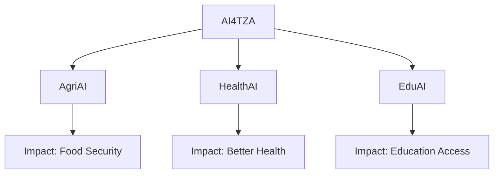

## Overview

AI4TZA harnesses artificial intelligence to drive positive change across Tanzania. You tackle pressing challenges like agriculture, healthcare, and education by deploying cutting-edge AI solutions. This empowers communities, unlocks growth opportunities, and fosters sustainable development.

<Callout kind="info">
AI4TZA focuses on practical AI applications tailored to Tanzania's unique needs, from crop yield prediction to disease outbreak forecasting.
</Callout>

## Mission and Vision

AI4TZA's mission empowers Tanzanians with AI tools that solve real-world problems. The vision builds a thriving AI ecosystem where technology accelerates national development.

You contribute through open-source projects, workshops, and partnerships. Join initiatives that bridge the AI skills gap and promote ethical AI adoption.

## Key Initiatives

Explore AI4TZA's core programs designed for Tanzania's priorities.

<Columns cols={3}>
  <Card title="AgriAI" icon="leaf" href="/initiatives/agriai">
    Predict crop yields and optimize farming with machine learning models.
  </Card>
  <Card title="HealthAI" icon="activity" href="/initiatives/healthai">
    Early disease detection using AI-powered image analysis.
  </Card>
  <Card title="EduAI" icon="book-open" href="/initiatives/eduai">
    Personalized learning platforms for remote Tanzanian students.
  </Card>
</Columns>



## Benefits of AI-Driven Development

AI transforms Tanzania's landscape. Use the tabs below to see sector-specific advantages.

<Tabs>
  <Tab title="Agriculture" icon="sun">
    Boost yields by `>30%` with predictive analytics. Farmers access real-time weather and soil data via mobile apps.
  </Tab>
  <Tab title="Healthcare" icon="heart">
    Reduce diagnosis time from days to minutes. AI screens X-rays for tuberculosis with `>95%` accuracy.
  </Tab>
  <Tab title="Education" icon="graduation-cap">
    Scale tutoring to millions. Adaptive algorithms personalize content for Swahili-speaking learners.
  </Tab>
</Tabs>

## Get Involved: Quick Start

Start contributing to AI4TZA today. Follow these steps to join a project.

<Steps>
  <Step title="Sign Up" icon="user-plus">
    Create an account on the AI4TZA platform at `https://platform.ai4tza.org`.
  </Step>
  <Step title="Choose Initiative" icon="target">
    Browse projects in AgriAI, HealthAI, or EduAI.
  </Step>
  <Step title="Run Your First Model" icon="play">
    Try this simple crop prediction example:
    
    <CodeGroup tabs="Python,JavaScript">
      ```python
      import pandas as pd
      from sklearn.ensemble import RandomForestRegressor

      # Load Tanzania rainfall data
      data = pd.read_csv('tanzania_rainfall.csv')
      model = RandomForestRegressor()
      model.fit(data[['temp', 'humidity']], data['yield'])
      prediction = model.predict([[28.5, 75]])
      print(f"Predicted yield: {prediction[0]:.2f} tons/ha")
      ```
      ```javascript
      // Using TensorFlow.js for browser-based prediction
      import * as tf from '@tensorflow/tfjs';

      const model = tf.sequential({
        layers: [tf.layers.dense({units: 1, inputShape: [2]})]
      });
      model.compile({optimizer: 'sgd', loss: 'meanSquaredError'});

      // Train with Tanzania crop data
      const xs = tf.tensor2d([[28.5, 75]]); // temp, humidity
      const ys = tf.tensor2d([[3.2]]); // yield
      await model.fit(xs, ys);
      ```
    </CodeGroup>
  </Step>
  <Step title="Collaborate" icon="users">
    Join the Discord community or submit pull requests on GitHub.
  </Step>
</Steps>

<Callout kind="tip">
Ready for more? Check [Quickstart](/quickstart) for advanced setup or [Initiatives](/initiatives) for project deep dives.
</Callout>

## Quick Navigation

<Columns cols={2}>
  <Card title="Documentation" icon="book" href="/docs">
    Full guides and API references.
  </Card>
  <Card title="Community" icon="message-circle" href="https://discord.ai4tza.org" target="_blank">
    Join discussions and events.
  </Card>
  <Card title="GitHub" icon="github" href="https://github.com/ai4tza" target="_blank" horizontal cta="Star Us">
    Contribute to open-source repos.
  </Card>
  <Card title="Contact" icon="mail" href="/contact">
    Reach the AI4TZA team.
  </Card>
</Columns>